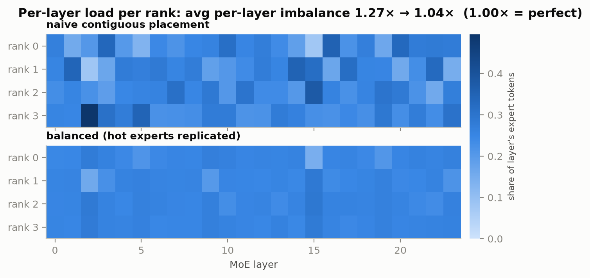
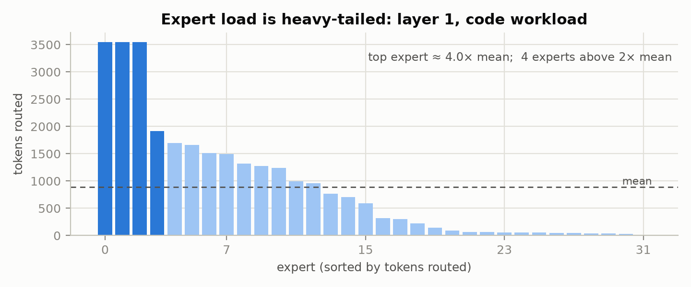
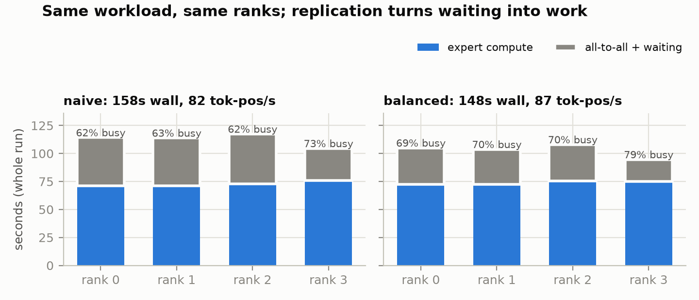

# mini-EP

**Goal.** mini-EP is a small, end-to-end experiment that demonstrates a specific
performance problem in expert-parallel Mixture-of-Experts (MoE) inference:
**per-layer load imbalance across workers**. It measures what that costs and
shows that a hot-expert-replication balancer removes most of the imbalance
*without changing a single output token*.

Concretely, it's a scrappy multi-worker inference server for a small open-weight
MoE
([granite-3.0-1b-a400m-instruct](https://huggingface.co/ibm-granite/granite-3.0-1b-a400m-instruct):
1.3B params, 24 layers × 32 experts, top-8 routing) that shards experts across
workers with all-to-all dispatch/combine, plus a **load balancer that replicates
hot experts**. Everything below the HF tokenizer is from scratch: the model, the
expert-parallel engine, the balancer, the server.

> New to MoE or expert parallelism? **[EXPLANATION.md](EXPLANATION.md)** builds up
> every concept from the ground up and walks through the whole codebase.

The point is the before/after:



## Results (4 workers, skewed code workload, 3 iterations)

| | naive contiguous | balanced (replicas) |
|---|---|---|
| per-layer load imbalance, avg over 24 MoE layers (max/mean) | 1.27× | **1.04×** |
| worst layer | 1.98× | **1.16×** |
| straggler overhead on expert compute¹ | 26.6% | **4.1%** |
| worker busy fraction (expert compute / busy+wait) | 62–73% | 69–79% |
| wall time | 158.1 s | **148.4 s** |
| throughput² | 81.9 tok-pos/s | **87.3 tok-pos/s (+6.6 %)** |

¹ Σ<sub>layers</sub> max<sub>rank</sub>(load) / Σ<sub>layers</sub> mean<sub>rank</sub>(load) − 1: the extra expert-compute time paid because each MoE layer
waits for its most-loaded worker.
² token positions (prefill + decode) processed per second, whole cluster.

Cost: 71 replicas ≈ **+9.2 % expert weight memory** (budget: 2 replica slots per
worker per layer). Runs are deterministic and repeatable: per-iteration times
were 52.3–53.2 s (naive) vs 49.1–49.9 s (balanced), non-overlapping; routing
counts are bit-identical across reruns. In live serving, `POST /rebalance`
computed a 66-replica plan from observed traffic and hot-swapped it in ~1 s.

## The problem

MoE routers are trained with load-balancing losses, but at inference time, on a
real (domain-skewed) workload, expert usage is heavy-tailed (a few experts are
hammered while most sit nearly idle):



With experts partitioned across workers, every MoE layer is a hard
synchronization point: tokens are dispatched all-to-all, each worker runs its
experts, results come back all-to-all. **The layer can't finish until its
most-loaded worker does; everyone else waits.** The subtlety this experiment
surfaces: **aggregate** per-worker load can look almost balanced while
**per-layer** load is badly skewed; the straggler rotates between workers layer
by layer, so you pay a max-vs-mean penalty at all 24 layers, not once.



**Why this is worth fixing.** Accelerators are the expensive resource, so a
worker that finishes its experts early and blocks at the layer's all-to-all
barrier is burning paid-for compute doing nothing. Because every layer waits for
its busiest worker, the imbalance stretches the expert-compute critical path
26.6 % beyond a perfectly balanced layer (the straggler tax), a cost paid at all
24 barriers with no gain in model quality to justify it. It surfaces as lower
throughput, higher latency, and worse cost-per-token, and at scale (bigger models,
more workers, longer context) the tail only gets heavier.

## What the balancer does

`miniep/balancer.py` takes measured per-(layer, expert) routing counts and
greedily adds **replicas** of hot experts on under-loaded workers (bounded by a
per-worker replica budget). Dispatch round-robins a replicated expert's traffic
across its copies. Replicas are weight-identical, so outputs are unchanged;
that's Gate C below.

## Why the before/after is trustworthy

The gap between the two columns is the cost of imbalance and nothing else. The
from-scratch model and engine are proven **bitwise-identical to HF `transformers`**
(Gate A) and correct under expert parallelism (Gate B), so the imbalance is a
property of the workload and placement, not a buggy engine. Runs are deterministic
and bit-repeatable, and the balanced placement adds only **weight-identical
replicas**; outputs are unchanged (Gate C), so only expert *placement* differs
between the naive and balanced columns.

## Correctness gates

Every stage must reproduce the reference before it counts:

| Gate | Check | Result |
|------|-------|--------|
| A | from-scratch model vs HF `transformers`: teacher-forced logits + 32-token greedy continuations on 8 fixed prompts | bitwise-identical logits (max abs diff 0.0; recorded in `results/gatea.json`), all continuations match |
| B | expert-parallel (world 2 and 4) vs reference | all continuations match, logit fingerprint < 3e-5 |
| C | EP + replicated placement vs reference | all continuations match |

All gate scripts exit non-zero on failure, so they can gate a CI pipeline.

## Run it

```bash
uv sync

# 1. reference outputs + routing stats (ground truth)
uv run python scripts/reference.py

# 2. gates
uv run python scripts/check_parity.py                          # Gate A
uv run torchrun --nproc-per-node 4 -m miniep.worker --mode gateb   # Gate B
uv run torchrun --nproc-per-node 4 -m miniep.worker --mode gateb \
    --plan results/plan_balanced.json                          # Gate C

# 3. before/after benchmark
uv run torchrun --nproc-per-node 4 -m miniep.worker --mode bench \
    --out results/bench_naive.json
uv run python scripts/make_plan.py results/bench_naive.json \
    --out results/plan_balanced.json --slots 2
uv run torchrun --nproc-per-node 4 -m miniep.worker --mode bench \
    --plan results/plan_balanced.json --out results/bench_balanced.json
uv run python scripts/make_charts.py

# 4. serve
uv run torchrun --nproc-per-node 4 -m miniep.worker --mode serve   # terminal 1
uv run python scripts/demo_serve.py --rebalance                    # terminal 2
```

The server exposes `POST /generate`, `GET /stats`, and `POST /rebalance`:
`/stats` reports per-rank totals plus per-layer imbalance (the aggregate-vs-
per-layer gap the demo is built around); `/rebalance` builds a fresh plan from
routing stats accumulated in production and hot-swaps expert placement **live**
(each worker re-slices the expert tensors for its new assignment from the
checkpoint: the rest of the model stays resident; no restart, no weight
transfer).

## How it works

- **Data-parallel attention, expert-parallel FFN.** Each worker holds the full
  non-expert weights and a shard of experts per layer, and processes its own
  slice of the batch. Per MoE layer: local top-8 routing → exchange per-rank
  counts → `all_to_all_single` of (hidden state, expert id) entries → owners run
  their experts → all-to-all back → combine.
- **Deterministic combine.** Returned contributions are permuted back to
  canonical token order before accumulation, so the accumulation order is fixed
  regardless of placement or world size: a plain (token, slot)-indexed scatter +
  sum with no atomic adds, so it stays deterministic on the nccl/CUDA port too.
  That removes the engine's own nondeterminism: generated tokens are identical
  across world sizes and logits match the reference to ~1e-5 (Gate B), which is
  what keeps the gates sharp.
- **Lockstep engine.** One batched prefill forward, then one forward per decode
  step on every rank (idle ranks run a masked dummy batch), so collectives always
  line up. Padding is masked out of both attention and MoE dispatch; padded
  positions never reach an expert or the load stats.
- **Stats.** Per rank: expert entries received per layer, expert-compute time,
  all-to-all(+wait) time; per (layer, expert): global routing counts; these feed
  the balancer, the charts, and `/stats`.

## Hardware note (read this)

Built and measured on a **CPU-only 4-core ARM box**. No GPUs were available, so
**4 `torch.distributed` (gloo) ranks stand in for 4 GPUs**. Everything the demo
demonstrates (expert sharding, all-to-all dispatch/combine, per-layer
stragglers, replication) is backend-independent. Porting to a real multi-GPU
node means initializing `nccl` instead of `gloo` and placing each rank's tensors
on `cuda:LOCAL_RANK` (weights already load sharded per rank); the collectives
and engine logic are unchanged. Numbers here are CPU numbers: the
compute/communication balance shifts with hardware, batch size, and model, so
treat this as a demonstration of the *mechanism* and a direct measurement of the
*imbalance*, not a throughput prediction for a particular GPU. Per-layer
expert-load imbalance (what the balancer targets) is hardware-independent; how
much wall time it buys back depends on how large a share of each step is expert
compute.

The **model** is a hardware-driven substitution too. The original target was
OLMoE-1B-7B, but at 14 GB in bf16 it doesn't run on 4 CPU cores.
granite-3.0-1b-a400m-instruct is the same architecture class (many small experts,
top-k softmax routing) at a size that fits, and nothing in the engine is
granite-specific.

## Honest limitations

- **Load shifts.** The balanced placement is fit to a measured window; when the
  workload drifts, imbalance creeps back. `/rebalance` re-fits from live stats,
  but there's no automatic trigger, no EMA windowing, and no hysteresis; a real
  system rebalances continuously and predictively.
- **Replication costs memory** (~9% extra expert weights here for the default
  budget) and only helps hot experts; it can't fix a layer where load is spread
  thin but uneven.
- **Per-round (static) batching** in the server, greedy decoding only, no KV
  paging, no chunked prefill, no dedup of (token → same rank) sends. All
  deliberate: the demo is about placement and balancing, not serving throughput.
- **CPU stand-in.** See hardware note; GPU validation is the obvious next step.
